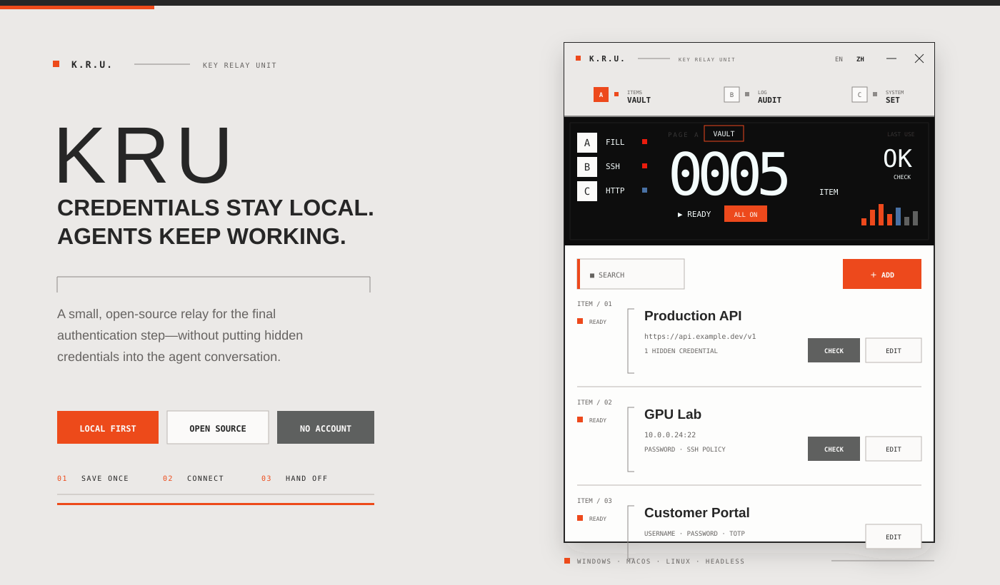
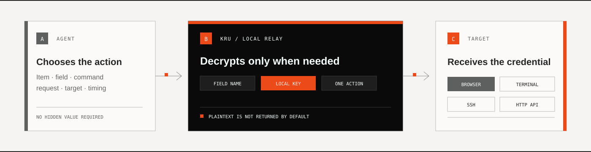

<p align="center">
  
</p>

<p align="center">
  <strong>Let agents use credentials without seeing them.</strong>
</p>

<p align="center">
  Local-first&nbsp;&nbsp;·&nbsp;&nbsp;Free and open source&nbsp;&nbsp;·&nbsp;&nbsp;No account&nbsp;&nbsp;·&nbsp;&nbsp;Portable
</p>

<p align="center">
  <a href="../../releases/latest"><strong>Download</strong></a>
  &nbsp;&nbsp;·&nbsp;&nbsp;
  <a href="README.zh-CN.md">Chinese</a>
  &nbsp;&nbsp;·&nbsp;&nbsp;
  <a href="SECURITY.md">Security</a>
</p>

---

## The last mile for agent authentication

Giving an AI agent a plaintext password is risky. Stopping every task to type it yourself defeats the point of automation.

KRU handles the step in between. Connect KRU to your agent, save a credential once, and let the agent hand off the final authentication action. KRU decrypts and uses the credential locally; the hidden value does not need to enter the conversation or model context.

<table>
  <tr>
    <td width="33%"><strong>01 / STORE</strong><br><br>Credentials are encrypted on your machine. No KRU account or cloud vault.</td>
    <td width="33%"><strong>02 / RELAY</strong><br><br>The agent sees available field names and actions—not hidden values.</td>
    <td width="33%"><strong>03 / ACT</strong><br><br>KRU performs the final fill, SSH authentication, or API authentication locally.</td>
  </tr>
</table>

<p align="center">
  
</p>

## Start in three steps

1. **Download and open KRU**
   Use the portable build for your platform. There is no account to create.

2. **Connect your agent**
   Open **System → Agent connection** and register a supported client.

3. **Save one item and start a new session**
   Add only the modules you need, then start a new agent session with KRU available.

KRU registers a local `stdio` MCP command. It starts when the agent needs it; no remote MCP endpoint is exposed.

## One vault, several last-mile actions

| Action | What the agent decides | What KRU does locally |
| --- | --- | --- |
| **Fill** | Field, timing, and focused target | Types the selected value into a browser, desktop control, or managed terminal |
| **SSH** | Host task and command | Authenticates with the stored password or private key and enforces the saved command policy |
| **HTTP** | Method, path, query, and body | Injects the stored API credential and sends the constrained request |
| **Terminal** | Program flow and input timing | Hosts the interactive process and writes a selected secret without returning it |

Items are assembled from independent modules instead of fixed “login / SSH / API” types. A single item can expose more than one action when its module combination supports it.

## Plaintext stays under your control

Each module has its own Agent visibility switch:

- **Hidden** — the default for secret modules. The agent may ask KRU to use the value but does not receive it.
- **Visible** — KRU may return that module value to the agent when you explicitly enable it.
- **TOTP** — KRU derives the current six-digit code; the permanent seed is never returned.

Optional **Review mode** pauses every secret use for a one-time local approval. The request shows the caller, item, action, and target—never the credential itself.

## Built for local use

<table>
  <tr>
    <td width="33%"><strong>Encrypted vault</strong><br><br>XChaCha20-Poly1305 protects stored fields. The machine key stays local.</td>
    <td width="33%"><strong>Portable backup</strong><br><br>Export an encrypted <code>.mvault</code> package and import it on another device.</td>
    <td width="33%"><strong>Auditable</strong><br><br>Local activity records show which client requested which action without logging secret values.</td>
  </tr>
</table>

### Browser filling

Unattended browser filling uses the bundled Chromium extension. KRU supplies one selected field to the currently focused control; it does not inspect the page, choose a field, click submit, or export cookies. Chrome, Edge, and Brave require one manual extension load on first use.

### Local PIN

The six-digit PIN locks plaintext viewing and local approvals in the GUI. It is an owner-view lock, not the vault encryption key. KRU has no PIN recovery flow in the current release.

## Downloads

All release builds are portable archives.

| Target | Package | Notes |
| --- | --- | --- |
| Windows x64 | `.zip` | GUI, tray, desktop input, browser extension |
| macOS arm64 | `.zip` | Native `.app`; Accessibility permission is required for desktop input |
| Linux x64 | `.tar.gz` | AppImage GUI; desktop input supports X11 |
| Linux x64 headless | `.tar.gz` | No WebView dependency; MCP, SSH, HTTP, terminal, backup, and browser bridge |

<p align="center">
  <a href="../../releases/latest"><strong>OPEN LATEST RELEASE →</strong></a>
</p>

## MCP surface

KRU intentionally exposes a small tool set:

```text
vault_items_list
secret_fill
ssh_execute
api_request
terminal_open · terminal_input · terminal_read · terminal_close
```

There is no unrestricted `get_secret` tool. `vault_items_list` returns item IDs, module metadata, non-secret target information, and derived actions. A module value is included only when its Agent visibility switch is on.

Manual `stdio` configuration:

```json
{
  "mcpServers": {
    "kru": {
      "command": "C:\\absolute\\path\\to\\kru.exe",
      "args": ["mcp", "stdio"]
    }
  }
}
```

KRU can also print client-ready configuration:

```text
kru config stdio-json
kru config stdio-toml
```

## Security model

KRU is designed to keep secrets out of normal MCP parameters, responses, application logs, and LLM API traffic. The KRU process and the final target necessarily handle plaintext briefly while an action runs.

KRU does **not** defend against a malicious agent, a compromised machine, a browser debugger, or another process running as the same OS user. It cannot determine whether the agent focused the correct input or chose a trustworthy target. Read the complete [security policy and threat boundary](SECURITY.md) before relying on KRU for sensitive infrastructure.

## Build from source

Requirements: Rust 1.88+, Node.js 22+, and the [Tauri 2 platform prerequisites](https://v2.tauri.app/start/prerequisites/).

```bash
npm install
npm run check
npm test
npm run build
npm run portable
```

Additional release targets:

```bash
npm run release:mac
npm run release:linux
npm run release:headless
```

## License

[MIT](LICENSE) — use it, inspect it, and improve it.
